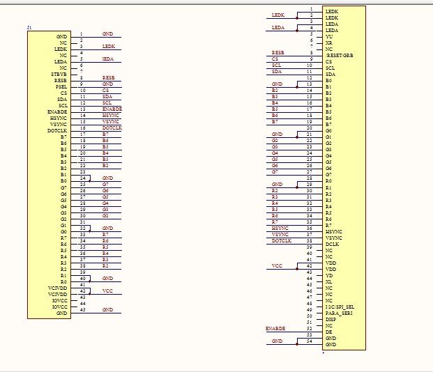
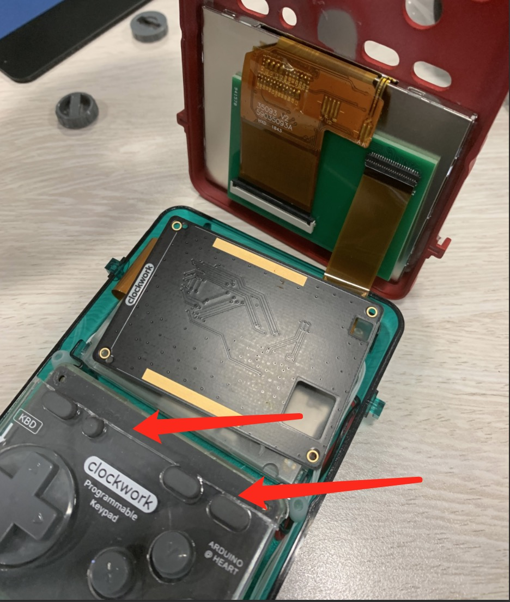

## GameShell魔改

### 感谢
首先需要感谢网友【梦中大佬】和【V】，非常感谢他们的热心指点、以及提供资料。我所有的参考都列在下方，基本都是依靠网友的前路，然后做了很小的修改完成的。

### 参考
> https://forum.clockworkpi.com/t/change-a-larger-lcd-screen-on-gs/4885/11

> https://www.cnblogs.com/lazy-v/p/12667486.html

### 屏幕
我测试了现在市面上能买到常见两款480P屏幕，都能点亮。能够无缝使用梦中大佬的PCB，具体购买连接见下。
> https://item.taobao.com/item.htm?id=620085054499

> https://item.taobao.com/item.htm?id=624580652735

实际上只要能对上梦中大佬PCB的引脚映射即可。可以找卖家要屏幕规格说明书，查看引脚定义。

### PCB打样
- 梦中大佬的PCB设计图：
    > https://github.com/Yvees/GameShellHacking/blob/main/PCB/adapter.PCB
- PCB直接使用了梦中大佬的PCB文件，淘宝找卖家打样即可。
- FPC连接器按照教程购买对应零件也没问题。
- FPC连接器却是非常难焊的，因为间距非常小，最后我是找的打样厂家帮我搞定的。我找到的店铺是这家，老板手艺非常的好。
    > https://item.taobao.com/item.htm?id=548377684758

### 3D打印外壳
梦中大佬替换屏幕的外壳虽然好，但是因为屏幕太大，实际上gameshell是装不下的，所以会需要对gameshell的键盘模块破坏性切割。

我的计划是无损可还原的改造，所以我简单修改了下上下外壳的模型，大约拉长了1cm左右。但是这样屏幕就能顺利装入了，也不用切割原有模块了。

需要的朋友可以在此下载
> https://github.com/Yvees/GameShellHacking/tree/main/3D%20model

### 连接线
因为更换了大屏，所以主板到电池的距离也对应增加了，原来白色的连接电线不够长了，所以重新买了2根4Pin双头通向20cm长的SH1.0mm端子线，连接见下。
> https://item.taobao.com/item.htm?id=654282791061

### 组装
最后的组装其实很简单了， 屏幕可以适当用一些不干胶固定。
另外因为背壳的长度也对应增加，所以主板的位置也会上移，下面就会有一部分空间多出来，随意塞一些填充物就好了。

### 系统内核
组装完后正常点亮可能屏幕显示会有问题，可以替换TF卡上对应的内核文件，这里也是使用的梦中大佬编译好的文件。
> https://github.com/Yvees/GameShellHacking/tree/main/kernel_480p

### 最后
还是要再次感谢网友【梦中大佬】和【V】，没有他们的指导不可能完成更换屏幕。
如果喜欢欢迎互follow我的github。
> https://github.com/Yvees